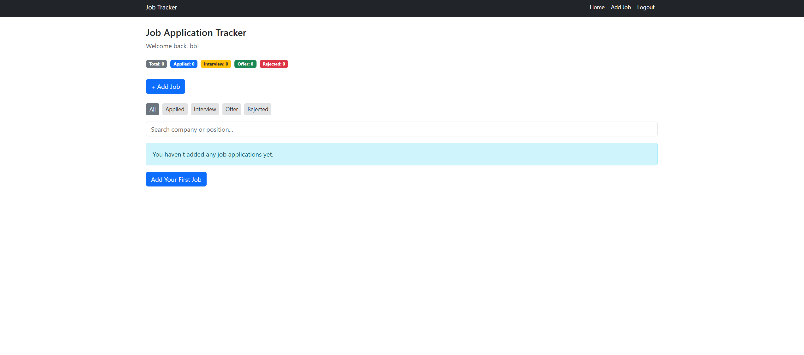
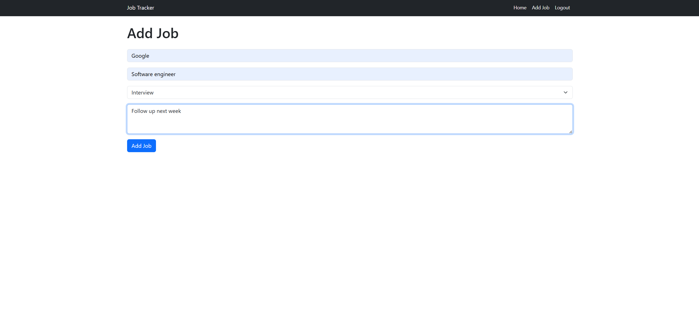
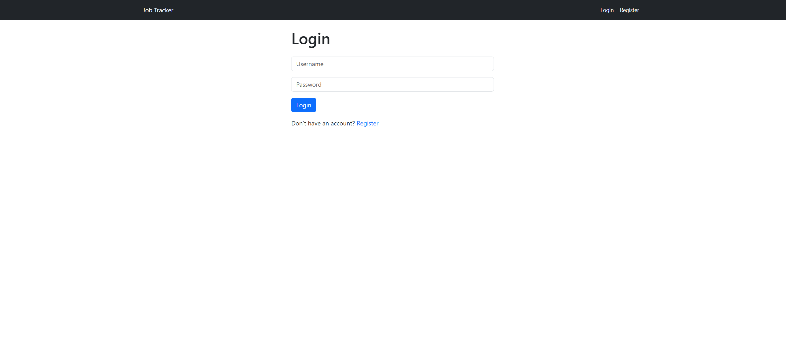

# Job Application Tracker

🔗 **[Live Demo](https://job-tracker-1-7jki.onrender.com/login)**

A full-stack web app for tracking job applications — register, log in, and manage your own list of applications with status tracking, filtering, and search.

## What it does
Add job applications with company, position, and status (Applied, Interview, Offer, Rejected). Filter by status, search by company or position, and see at-a-glance counts for each stage of your pipeline. Each user only sees their own data.

## Tech stack
- Python, Flask
- SQLite
- Jinja2, Bootstrap, HTML/CSS
- Werkzeug (password hashing)

## Why I built it
I was tracking my own job applications in a spreadsheet and wanted something built specifically for the workflow.

## What I'd improve with more time
- Sort applications by date or company name
- Email reminders for follow-ups

## Usage

- Register a new account
- Log in
- Click **+ Add Job** to create a new job application entry
- Use the status filter buttons or the search bar to find specific applications
- Edit or delete any application from its card

## Environment Variables

Create a `.env` file in the project root:

\`\`\`
SECRET_KEY=your-random-secret-key-here
\`\`\`

A fallback key is used for local development if `SECRET_KEY` isn't set, but you should always set your own in production.

## Running it locally
\`\`\`bash
pip install -r requirements.txt
python app.py
\`\`\`

## Author

Built by Paul as part of a portfolio project.